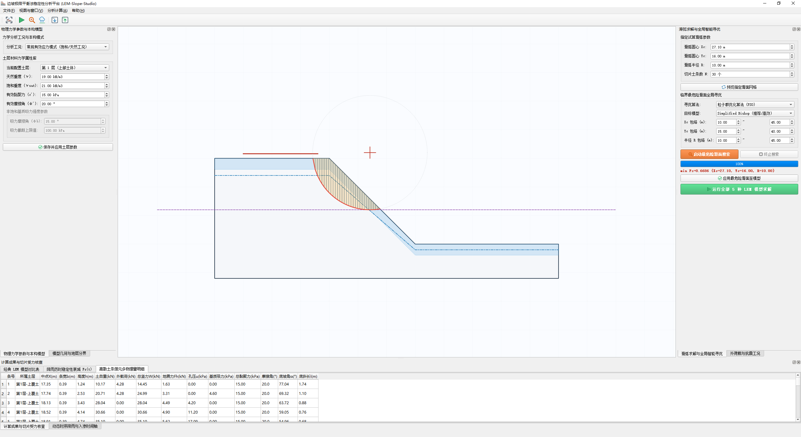

# LEM-Slope-Studio 边坡极限平衡法稳定性分析平台

基于 **Python** 与 **PyQt (QGraphicsView CAD 架构)** 开发的边坡极限平衡法（LEM）稳定性计算与临界滑面智能全局寻优软件。



---

## 核心功能特性

1. **经典极限平衡（LEM）模型全覆盖**：
   * **Fellenius (瑞典条分法)**：忽略条间力，力矩平衡显式解。
   * **Simplified Bishop (简化毕肖普法)**：水平条间力，非线性定点迭代求解。
   * **Simplified Janbu (简化让布法)**：水平力平衡，结合 $d/L$ 深度比的 $f_0$ 经验形状修正。
   * **Spencer (斯宾塞法)**：严密完全平衡法，联立牛顿法求解 $(F_s, \theta)$。
   * **Morgenstern-Price (M-P / GLE 法)**：广义极限平衡法，支持半正弦波条间剪力函数 $f(x)$，联立求解 $(F_s, \lambda)$。
2. **临界最危险滑面智能寻优体系**：
   * **PSO (粒子群优化算法)**、**SA (模拟退火算法)**、**DE (差分进化算法)**、**Nelder-Mead (单纯形法)**、**Grid Search (传统网格扫描法)**。
3. **专业 CAD 级矢量交互视口**：
   * 基于 Qt 原生 `QGraphicsView` 架构，告别 Matplotlib 位图重绘卡顿。
   * 真实工程右手坐标系（米级直通，高程 Y 向上），支持鼠标滚轮平滑缩放与中键平移。
   * 土条微元对象化交互：鼠标悬停土条即时变色高亮，并弹出自重、底角、孔压等力学属性卡片。
4. **水力与材料模型**：
   * 莫尔-库仑（Mohr-Coulomb）抗剪强度准则。
   * 支持干燥状态、孔压比系数 $r_u$ 与固定地下水浸润线。

---

## 运行环境与安装

* Python 3.8+
* 依赖库：
  ```bash
  pip install numpy scipy pyqt5
  # 若使用 PyQt6: pip install numpy scipy pyqt6
